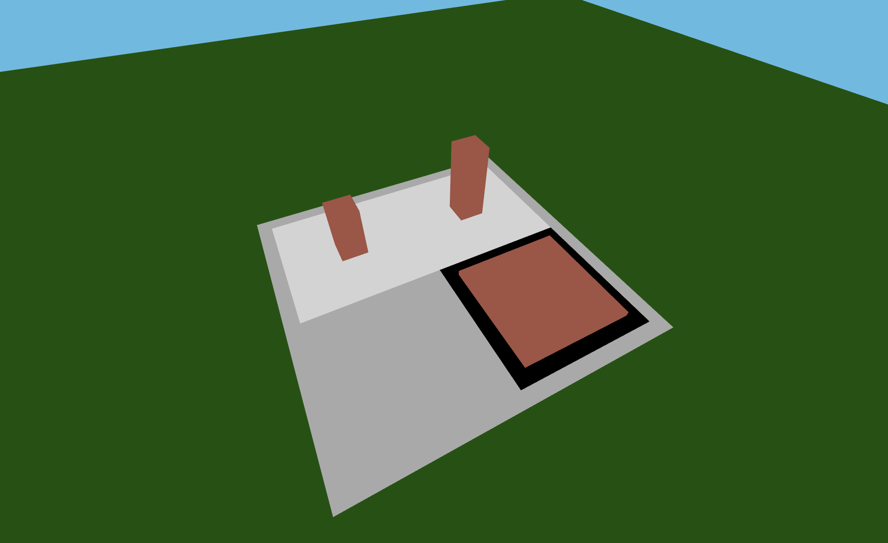

# Software City Demo

## Purpose
This Demo was created to illustrate how an intermediary JSON format can be used to visualize components of software as a so called "Software City". This a demo uses a small set of arbitrary data.
The primary purpose of this project is for me to include this quick demo in a project report.
I did not bother with making sure, that the street connection feature works well. It pretty much only works properly if buildings are in the same row.



## Quickstart
Requires installation of [NodeJS](https://nodejs.org/en/download).

```
git clone https://github.com/EdwardSpaeth/Praxisphase-Software-City-Demo.git
cd Praxisphase-Software-City-Demo
npm install
npm run dev
```

After that the application should automatically open in your default web browser.
